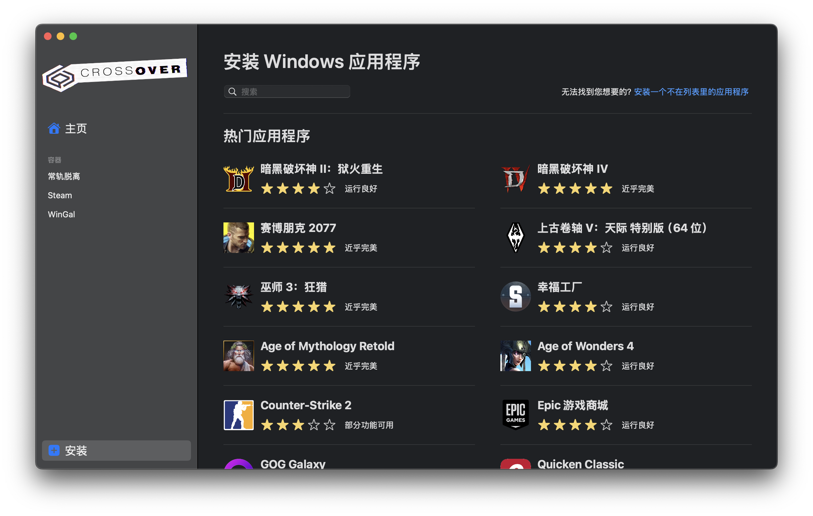
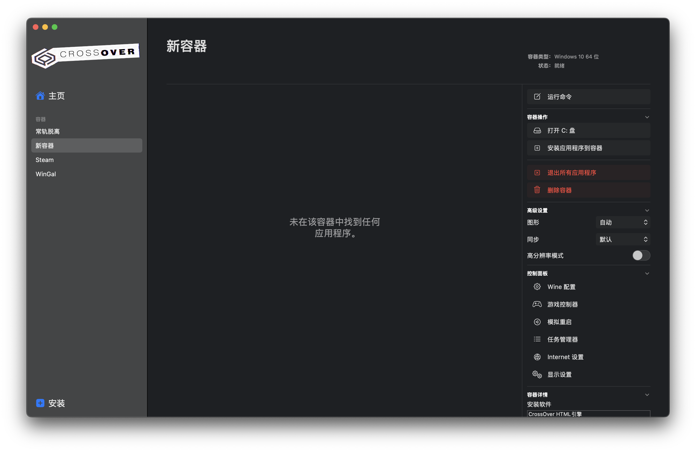
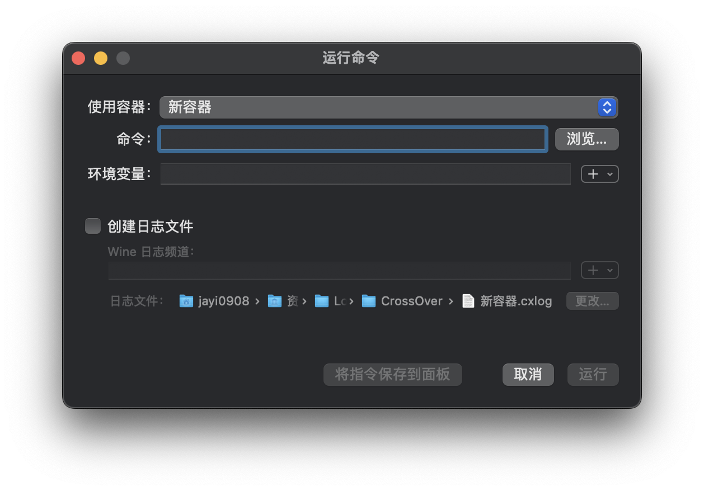
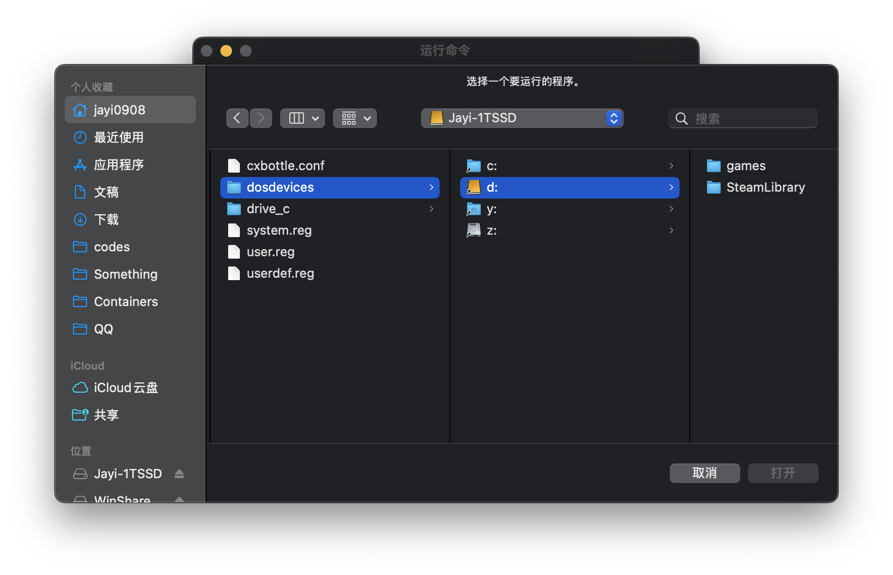

# 在 Mac 上玩游戏

> \- “你的家族有精神病史吗？”
>
> \- “我有个叔叔买 mac 打游戏.”

众所周知，Mac 打游戏一直是一件有点“荒唐”的事情，因为很多游戏都没有做和 Mac 兼容的版本，这和 Mac 的芯片架构、系统设计以及硬盘空间等方面的限制都有不小的关系. 当然，Mac 并不是打不了游戏，近些年 Apple Arcade 不断发力（但是我没用过不太了解），像 Minecraft 这样的游戏本身也是支持 Mac 的，但还是有很多大家耳熟能详的游戏是没有 Mac 版本的. 但没有不代表不能玩，下面是一些在 Mac 上玩游戏的方案，能够让你在 Mac 上玩到更多的游戏.

> 这里推荐一个网站 [Apple Game Wiki](https://www.applegamingwiki.com/wiki/Home)，上面介绍了很多支持在 Mac 上运行的游戏以及相关的工具，可以先看看你想玩的游戏是否支持在 Mac 上运行，以及它们的运行方式是什么样的，这样就能更有针对性地选择方案了.

## 远程连接到 Windows 电脑

这是最简单也支持游戏最多的方案了，只要远程连接软件合适，通信质量良好，那么在 Mac 上玩游戏的体验就和在 Windows 电脑上玩差不多了. 但是并不是所有的时候通信质量都能保证，以及远程连接软件也存在一些画质的损失，所以如果能在 Mac 本地有性能不错的游戏运行方案，肯定是比远程连接更好的.

## PlayCover

::: danger 阅前须知
使用 PlayCover 运行网络游戏时最好提前查阅网上信息，在 PlayCover 上运行某款游戏是否有被封号的风险，因为 PlayCover 的原理是模拟 iOS 设备的运行环境，某些游戏可能会检测到这种模拟环境并将其视为违规行为，进而导致账号被封禁，所以在使用 PlayCover 运行网络游戏之前，最好先查阅相关信息以确保安全.
:::

在[获取软件](../software/index.md#playcover)一章提到了使用 PlayCover 能在 Mac 上运行 iOS 游戏，并且几乎没有性能损失，只要获取到了合适的 `.ipa` 文件就可以运行游戏. 但是问题是游戏文件往往比较大，如果 Mac 的存储空间不足（尤其是 256GB 的 Mac），游戏全部放在 Mac 本机存储的话会给本就紧张的存储空间带来更大的压力，所以如果能把游戏文件放在一个外接硬盘上，既能节省 Mac 本机的存储空间，又能保证游戏的性能，这样就非常好了. 

::: tip 注意
为了保证游戏运行流畅，推荐使用固态硬盘（SSD），并且存储游戏文件的盘格式建议使用 APFS.
:::

以下以绝区零这款游戏为例，详细说明如何将游戏大文件迁移至外接硬盘并正常运行.

通过 PlayCover 安装的应用，其主程序文件存放于 `~/Library/Containers/io.playcover.PlayCover/Applications/` 目录下的 `.app` 文件夹中，而游戏核心资源文件则存储在 `~/Library/Containers/` 目录下对应的应用容器目录内. PlayCover 下载的绝区零与原神的特点是应用主体（.app）体积较小，但资源文件极其庞大，因此实现外接硬盘运行的核心思路很明晰：定位游戏容器目录，将其中的大体积资源文件迁移至外接硬盘，并通过挂载方式让游戏运行时能正确访问外接硬盘的资源文件.

首先我们需要在电脑上定位运行绝区零的容器目录. 将绝区零的 `.ipa` 文件导入 PlayCover 安装游戏，启动游戏至弹出用户协议弹窗或登录弹窗后退出（此操作会触发容器目录生成），不出意外的话在 `~/Library/Containers/` 中就会出现绝区零的容器目录. 绝区零国区版本的容器目录默认名为 `com.miHoYo.Nap`（国际服目录名称会略有差异，可通过访达查看目录显示名称，通常为 “绝区零” 或 “ZenlessZoneZero”，拖拽目录至终端可获取准确路径）.

该目录的文件结构大致如下：

```txt
.
└── Data
    ├── Desktop -> ../../../../Desktop
    ├── Documents
    │   ├── base_version_hash
    │   ├── Bundles
    │   ├── clShanYanSDK2InitModel
    │   ├── CLShanYanSDKDataList.sqlite
    │   ├── LocalStorage
    │   ├── LogDir
    │   ├── mihoyosdk
    │   ├── porte
    │   └── Predownloads
    ├── Downloads -> ../../../../Downloads
    ├── Library
    │   ├── 281347*********
    │   ├── Application Scripts
    │   ├── Application Support
    │   ├── Audio -> ../../../../Audio
    │   ├── Caches
    │   └── [其余系统级软链接目录省略]
    ├── Movies -> ../../../../Movies
    ├── Music -> ../../../../Music
    ├── Pictures -> ../../../../Pictures
    ├── SystemData
    └── tmp
        ├── hib
        ├── naptrashbin.bin
        ├── swcache
        ├── TemporaryItems
        └── WebKit
```

经实测，直接将整个容器目录迁移至外接硬盘，并在原路径创建软链接的方式不可行 —— Mac 的沙盒容器机制会模拟独立的运行环境，包含大量系统级软链接和权限配置，迁移整个目录会导致系统无法识别这些配置，进而引发游戏运行异常，所以合适的方法是仅迁移容器目录中「包含核心游戏资源且无系统软链接」的子目录. 对于绝区零来说，`Data/Documents` 目录满足这个条件，并且经过尝试，通过将外接硬盘的宗卷直接挂载至 Data/Documents 路径，可以正常启动游戏，外置存储资源文件且不破坏容器的原有环境，除此以外还有一些其他的细节，这里不再赘述，可以参考我自己写的 bash 脚本，可实现外接硬盘的自动挂载、权限配置及游戏启动.

```bash
function zzz(){
    VOLUME_NAME="ZenlessZoneZero"
    USER_NAME=$(whoami)
    TARGET_PATH="/Users/${USER_NAME}/Library/Containers/com.miHoYo.Nap/Data/Documents"
    GAME_PATH="/Users/${USER_NAME}/Library/Containers/io.playcover.PlayCover/Applications/com.miHoYo.Nap.app"

    if mount | grep -q " on ${TARGET_PATH} ("; then
        echo "✅ 检测到磁盘已挂载于目标路径，跳过挂载步骤。"
    else
        DISK_ID=$(diskutil list | grep "${VOLUME_NAME}" | awk '{print $NF}')
        if [ -z "$DISK_ID" ]; then
            echo "❌ 错误：未找到名为 '${VOLUME_NAME}' 的磁盘卷。"
            return 1
        else
            echo "✅ 检测到 ${VOLUME_NAME} 的盘符为: ${DISK_ID}"
        fi

        DEFAULT_MOUNT="/Volumes/${VOLUME_NAME}"
        if [ -d "$DEFAULT_MOUNT" ]; then
            diskutil unmount "${DEFAULT_MOUNT}"
            sleep 1
        fi

        if [ ! -d "$TARGET_PATH" ]; then
            mkdir -p "$TARGET_PATH"
        fi

        echo "🚀 准备挂载到目标路径: ${TARGET_PATH}"
        sudo -S mount_apfs /dev/${DISK_ID} "${TARGET_PATH}" <<< <Your Password of root user>
    fi

    echo "修改磁盘的读写权限，使得文件可以正常写入"
    sudo -S chown -R $(whoami):staff "$TARGET_PATH" <<< <Your Password of root user>
    sudo chmod -R 755 "$TARGET_PATH"
    sudo chown -R $(whoami):staff "$GAME_PATH"
    sudo chmod -R 755 "$GAME_PATH"

    echo "🚀 准备启动绝区零..."
    ${GAME_PATH}/ZenlessZoneZero > /dev/null 2>&1 &
}

```

- 该脚本会首先检查目标路径是否已经挂载了外接硬盘，如果已经挂载则跳过挂载步骤，否则会尝试找到指定名称的磁盘卷并将其挂载到目标路径.
- 挂载完成后会修改目标路径的权限，确保游戏能够正常读写，因为游戏在启动时会不定期更新资源文件，如果不修改权限的话可能会导致游戏无法正常运行.
- 完成上述目标后启动绝区零，并将输出重定向到 `/dev/null` 以略去启动过程中的日志输出.

为了使用该脚本，需要先在自己的移动硬盘上创建一个名为 `ZenlessZoneZero` 的宗卷（格式建议使用 APFS），然后将容器目录中的 `Data/Documents` 目录下的内容迁移至该宗卷中，最后将上述脚本中的 `<Your Password of root user>` 替换为当前用户的密码（这样可以在执行脚本时自动输入密码以获得必要的权限，也可以考虑使用其他更安全的方式来 `sudo`）. 之后每次运行该脚本就会自动挂载外接硬盘并启动游戏，整个过程无需手动干预.

::: note collapse 如果直接挂载宗卷无法正常启动游戏
有些游戏存储大型文件目录的顶层目录可能会有一些奇奇怪怪的限制，导致在该位置即使挂载外接硬盘，在启动游戏时游戏不会读写外接硬盘内的数据导致游戏启动失败. 这时可以选择将该目录替换成一个指向容器内其他权限不受限制的目录（甚至可以考虑新建，不过这样有风险）的软链接，并在软链接指向的目录处挂载外接硬盘，这样就能绕过该限制了. 以绝区零为例，如果直接挂载宗卷到 `Data/Documents` 目录无法正常启动游戏的话，可以将 `Data/Documents` 目录替换成一个指向另外一个目录的软链接，并在该目录处挂载外接硬盘，这样就能正常启动游戏了.
:::

::: info collapse 其他的游戏呢
绝区零是一款比较热门又具有代表性的游戏，关于容器沙盒限制绕过的思路上面的处理还是相对通用的. 

可能有人会说原神更热门更具代表性，但因为一些特殊原因，这里选择不放出有关 PlayCover 运行原神的教程，但是大体上的思路是类似的.
:::

## CrossOver

> 本人对 CrossOver 的了解也不算深入，这部分的介绍基本上基于我个人的使用经验，<s>可能稍微有点小白</s>，后面可能会进行一些补充和修改.

PlayCover 的优点在于它运行游戏几乎没有性能损失，但缺点是它只能运行 iOS 游戏，大部分 Windows 游戏实际上并没有 iOS 版本，不存在 `.ipa` 文件，所以 PlayCover 的适用范围还是非常有限的. 如果想在 Mac 上玩更多的 Windows 游戏，CrossOver 就是一个不错的选择了.

::: info 什么是 CrossOver 以及使用之前需要了解的事情
[CrossOver](https://www.codeweavers.com/crossover) 是一个基于 Wine 的兼容层软件，能让你“运行”Windows 应用程序和游戏，<s>但并不承诺能让你“顺利使用”它们</s>，感兴趣的可以参考[这篇文章](https://www.lapis.cafe/posts/technicaltutorials/crossover-hamidashi-debug/).

关于 CrossOver 与 Wine 的原理这里不再赘述，简而言之就是将 Windows 的系统调用实时转换为宿主系统（在这里就是 macOS）的系统调用，也就是“转译”. 跨系统转译会带来性能损失，所以 CrossOver 的性能表现比 PlayCover 要差一些，并且由于 Windows API 的非公开性和复杂性，很容易出现各种各样的兼容性问题（这也是为什么 CrossOver 不承诺能让你顺利使用 Windows 应用程序的原因）. （很有可能）如果遇到了一些无法解决且搜不到（<s>或者不想搜</s>）的兼容性问题，可能就要考虑其他方案了.
:::

尽管 CrossOver 存在各种各样的问题，但是它确实支持运行相当数量的 Windows 游戏. 首先 CrossOver 支持 Steam（还是 Windows 版的，Mac 用户可能都知道 Steam 是有 Mac 版本的，但是很多游戏都无法下载），只要你的 Mac 性能够好，理论上 3A 大作也是可以跑的（可能需要 Pro 版本的 Mac），我个人游戏玩得比较少，如果对这部分感兴趣可以搜索 B 站上相关的评测视频. 其次如果你的游戏对性能要求不高，那么 CrossOver 大概率也可以胜任运行该游戏. 除此以外，CrossOver 支持启动外接硬盘（甚至通过网络共享挂载的远程存储）上的游戏文件，并且 CrossOver 启动的应用也秉持了 Mac 的窗口特点，看起来就像是一个普通的 Mac 应用一样，还是非常不错的.

<figure style="text-align: center;">

<!-- <figcaption> -->
<small>CrossOver 启动应用示例（<s>亚澄小天使啊啊啊</s>）</small>
<!-- </figcaption> -->
</figure>

咳嗯，说完了 CrossOver 的优缺点，重要的还是如何使用. 首先介绍 CrossOver 最重要的机制：“瓶子”(Bottle). 每个瓶子都是一个独立的 Windows 运行容器，但是不同于 Mac 的容器沙盒，CrossOver 的瓶子是完全开放的，它可以访问 Mac 上用户级权限能访问到的任何文件，并且对于指定的可执行文件，只要在容器中预装好必要的运行环境（比如 .NET Framework、Visual C++ Redistributable 等），不论该可执行文件存放在 Mac 本机还是外接硬盘上，CrossOver 都能正常访问并运行它，所以可以非常方便的将游戏文件直接存放在外接硬盘上，完全不占用 Mac 本机的存储空间. 由此可见使用 CrossOver 运行游戏的核心步骤就是对于每个游戏创建好需要的瓶子，对于某类特点相似的游戏还可以共用一个瓶子，还是非常方便的. 

然后就是瓶子的创建和配置. CrossOver 支持从其提供的应用列表中安装已有的程序（如 Steam，这样的话可以自动建立瓶子并安装好相应的依赖），也支持从本地的安装包（如 .exe、.msi 等）安装程序（需要手动创建瓶子并安装好相应的依赖），还支持直接创建一个空瓶子，然后在该瓶子中安装依赖（这适用于免安装的游戏或程序）.

<figure style="text-align: center;">

<!-- <figcaption> -->
<small>CrossOver 安装界面</small>
<!-- </figcaption> -->
</figure>

有了瓶子之后我们就可以选择配置了. 

<figure style="text-align: center;">

<!-- <figcaption> -->
<small>bottle 配置界面</small>
<!-- </figcaption> -->
</figure>

- 通过运行命令我们可以指定可执行文件的路径（通过浏览打开访达即可），环境变量的配置我不太懂，待补充. 选中可执行文件后将指令保存在面板可方便以后直接运行.

<figure style="text-align: center;">

<!-- <figcaption> -->
<small>运行命令界面</small>
<!-- </figcaption> -->
</figure>

- 打开 C 盘允许我们打开瓶子的 C 盘在 Mac 上的存储位置，通过安装应用程序到容器的方式安装的程序默认在 C 盘的 `Program Files` 目录下.
- 退出应用程序可以方便的中断应用程序的进程，尤其是当应用程序出现异常无法正常退出时非常有用.
- 图形和同步的配置和转译相关，关系到游戏的性能表现以及能否正常运行. 一般来讲，DX12 的游戏图形使用 D3DMetal，DX11 的游戏使用 DXMT，要知道运行的游戏基于哪个的话直接搜索就可以，DX10 及以下的话可以考虑使用 DXVK 和 Wine. 同步的话一般默认就够了，高分辨率模式看情况打开即可.
- Wine 配置 -> 驱动器界面可以添加驱动器并指向指定目录，好处是可以通过这种方式指定外接磁盘的指定目录作为一个驱动器，在运行命令并保存时按照驱动器的路径来指定可执行文件的位置，这样磁盘卸载之后再次载入磁盘位于外接磁盘上的程序也能正常运行. 这里以指定 D 盘为外接磁盘目录为例，在选择可执行文件在外接磁盘时按照图示选择即可.

<figure style="text-align: center;">

<!-- <figcaption> -->
<small>驱动器配置界面，如图按照 dosdevices -> d: -> 后续目录 的方式进行指令的保存</small>
<!-- </figcaption> -->
</figure>

配置好之后点击保存的指令或者从运行指令界面选定可执行文件就可以直接运行了，如果一切顺利的话就能在 Mac 上玩到 Windows 游戏了. 

这里引流一下本人写的一个应用 [MacGal](https://github.com/jayi0908/MacGal)，目前更新到 v0.1.0 版本，支持配置好 CrossOver 容器的情况下导入游戏的可执行文件并直接运行，且支持游戏时长的统计，<s>目前仍在绝赞更新中.</s>

## Parallels Desktop 虚拟机

Parallels Desktop 是一款在 Mac 上运行 Windows 虚拟机的软件，安装好 Parallels Desktop 后就可以在 Mac 上创建一个 Windows 虚拟机，在虚拟机里安装 Windows 系统，然后就可以在这个 Windows 虚拟机里安装和运行各种 Windows 游戏了. 不过我个人没有购买这款产品，也没有使用过，所以不太清楚它的性能表现和兼容性如何，感兴趣的话可以自己去了解一下.