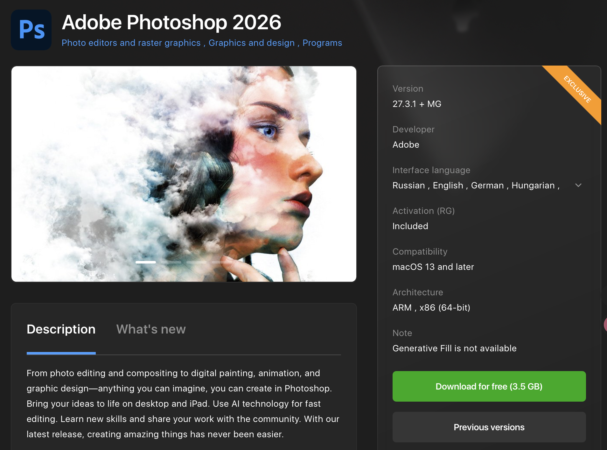
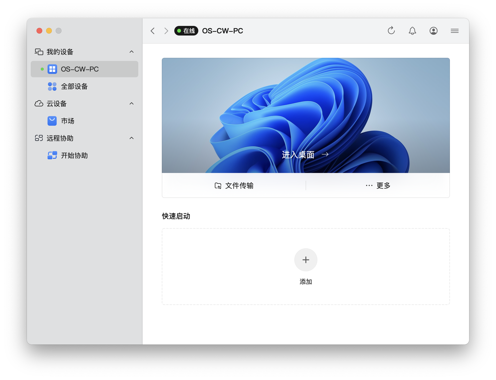

# 获取 Mac 软件

要想在 Mac 上使用某个功能或软件，首先最重要的是如何获取到对应的 APP 或可执行文件，下面就统称为软件了. 由于 Mac 的软件生态相对封闭，获取软件往往并不是一帆风顺的事情，但大体上来说，获取 Mac 软件可以遵循如下路径.

::: warning 注意
这里默认用户知道该如何科学上网，因为使用 Google Search 与访问 GitHub 资源这些都是需要科学上网的.
:::

## App Store

获取软件最权威的途径就是应用商店或官网下载. 由于 Mac 的安全性限制较为严格，使用 App Store 获取软件是最省心（也最安全）的方式，通过 App Store 获取的软件会经过苹果的审核，基本上来说是没有安全问题的，下载后也能直接使用. 但问题就是 App Store 上的软件数量有限，而且有些软件还要收费，另外由于 Mac 和 iPad 其实是共享一个 App Store 数据库的，所以有些软件的评价和下载量可能会被 iPad 用户的评价和下载量影响（当然我觉得下载一个软件很多时候是因为需要这个软件的功能，而不是因为它的评价和下载量，所以这点也不算是太大的问题了），以及不少软件都存在 App Store 上架但 Mac 无法安装的情况（比如原神），所以还需要其他的途径来获取软件.

::: info collapse 关于原神与 Mac

<s>众所不周知</s>，原神的 iOS 版本在 iPad 上运行得非常好，启动游戏的速度以及流畅度完全不输给 PC 版本（以我个人的 32G+1T Windows 轻薄本为例，开门速度比 iOS 版慢十几秒，后者几秒就能开门）. 而现在 iPad 和 Mac 实际上都是 Apple Silicon 架构的芯片，所以理论上来说原神和 Mac 的兼容性应该是非常好的，只需要开发者稍微调整一下就能发行 Mac 上可运行的版本了，但是因为各种各样的原因，miHoYo 没有发布 Mac 版本的原神，所以 Mac 上要玩原神只能通过一些第三方工具来实现了. 只能说期待 miHoYo 将来能发布 Mac 版本的原神了，当前只能喊一声牢米了.

:::

## 搜索引擎搜索下载

虽然有很多用 Mac 的用户实际上只是因为苹果的生态或者 MacBook 的性能而选择了 Mac，但是<s>你都用 Mac 了，还是高低得懂点计算机吧.</s> 至少当你需要一个东西的时候，应该知道先去搜索引擎里找一找有没有合适的资源. 当你选择了合适的搜索引擎（Google 或 Bing 或者其他的稍微小众但你觉得好用的都行）之后，以你需要的软件的名称为关键词进行搜索，一般比较常见的软件都能在搜索之后的若干条目中找到官网或者其他可靠的下载链接（托管在 GitHub 上等可靠的第三方平台上），不确定链接的话直接问 AI 就好了. 

需要注意的是，Mac 版的软件下载的文件后缀名一般是 `.dmg` 或者 `.pkg`. 前者是磁盘映像文件，相当于在电脑上挂载一个虚拟磁盘，需要将磁盘内的软件拖拽到应用程序文件夹中，表示安装了该程序；后者是安装包文件，直接点击运行就会进入安装界面，按照提示操作即可完成安装. 另外还有一些软件是以压缩包的形式提供下载的，这种情况下需要先解压缩，然后可能包含一个可执行文件或者一个安装包，按照前面两种方式进行安装即可. 根据芯片架构的不同，`.dmg` 或 `.pkg` 文件名可能会有 `x86_64/amd64`（Intel）和 `arm64/aarch64`（Apple Silicon）的后缀，需要根据自己的 Mac 的芯片架构选择对应的软件版本进行下载和安装.

## 包管理器下载

这个方法一般下载下来的软件是命令行版本的，以及像 VSCode、Chrome 这种比较有名的 Mac 桌面应用，适合一些开发者或者喜欢在终端里操作的用户. 在 Mac 上最负盛名的包管理器就是 Homebrew 了，`brew install` 接管一切，想要的软件直接 `brew search`，并且由于是终端命令行操作，询问 AI 得到的结果可信度也相对较高. 但是命令行操作还是需要一定的计算机基础的，不然（特别是借助AI）万一运行了什么恶意命令就麻烦了，最好永远确保自己知道自己在运行什么命令.

## 第三方下载平台

上面说的都是非常官方正式的获取软件的途径，但是实际上由于各种各样的原因，有很多软件没有明面上的免费下载途径，但是又有很多质量很好或者功能不可替代的应用落在这个圈子内，所以需要知道一点破解的获取途径. 这里就推荐一个比较靠谱的[第三方下载平台](https://appstorrent.ru/)，为俄语网站，应该是国内直连可以访问，但是挂日美等节点无法访问. 



这个平台上提供很多收费 Mac 应用的破解版下载，获取的合理性懂的都懂. 以图中的 Adobe Photoshop 为例，可以看到应用的名称、版本、大小、发布日期、系统要求等信息都是比较清晰的，同时也提供一些历史版本的下载，用户可以根据自己的需要选择下载对应版本的软件. 当然由于第三方下载，很有可能会受到 Mac 的安全风控，所以安装包中一般都会提供 README 提供安装说明，在网站的应用安装页面下方也会有一些用户的评论，里面一般会提到安装过程中遇到的问题以及解决方法，用户可以参考这些评论来顺利安装软件. 需要注意的是，虽然这个平台提供了很多软件的破解版下载，但用户在下载和使用这些软件时需要注意版权问题，确保自己合法使用软件，并且要注意安全风险，避免下载到恶意软件.

## 一些推荐的软件

### ClashX

Clash 系列是非常有名的网络代理工具，ClashX 是其中专门为 Mac 用户开发的版本，其性能开销低，功能强大，支持多种协议和规则配置，适合科学上网使用. 可以访问[官网下载](https://en.clashx.org/download/)或直接下载[映像文件](https://github.com/clashdownload/ClashX/releases/download/1.118.0/ClashX.dmg)（这里只有 1.118.0 版本的）. 但是由于资源在 GitHub 上，直接下载需要科学上网，需要下载科学上网工具，Mac 上的话下载 ClashX 作为科学上网工具，<s>这不是完美闭环了吗.</s>

当然实际上是有解决办法的，在无法科学上网时使用镜像站 https://gh-proxy.com 即可，将上面的映像文件链接输入其中就能得到一个新的链接，直接访问新的链接就能下载了（当然，该镜像站也适用于下载 GitHub 上的其他资源），或者直接访问[这个链接](https://gh-proxy.org/https://github.com/clashdownload/ClashX/releases/download/1.118.0/ClashX.dmg)下载.

### App Cleaner

Mac 由于其较为独特的软件安装方式，卸载软件也不是简单地将应用程序拖到废纸篓里就能完成的事情，但是又不像 Windows 那样将程序安装在某个固定的目录下，到时候直接 Shift+Delete 永久删除就能解决，所以 Windows 思维的用户在 Mac 上卸载软件的时候可能会遇到一些麻烦，App Cleaner 就是专门为了解决这个问题而开发的工具，它能够帮助用户彻底卸载 Mac 上的软件，包括删除相关的配置文件、缓存文件等，确保软件被完全清除掉，不会留下残余文件. 这里有两个 App Cleaner：

- [FreeMacSoft AppCleaner](https://freemacsoft.net/appcleaner)：这是一个免费的 App Cleaner，将应用拖拽到该应用窗口中，或者将其固定在程序坞中在启动台内将应用拖拽至程序坞中该应用的图标，两种方法都可以卸载软件，能够扫描并删除相关的文件和文件夹，适合一般用户使用. 优点是免费、干净、轻量，缺点是只能卸载软件，没有多余的系统优化或清理功能.
- [App Cleaner & Uninstaller](https://nektony.com/mac-app-cleaner)：这是一个收费的 App Cleaner，提供更多的功能和更强大的卸载能力，除了基本的卸载功能外，还提供了系统清理、隐私保护、重复文件查找等功能，适合需要更全面系统维护的用户使用. 优点是功能丰富，缺点是需要付费购买.

### Plash

Plash 是一个非常有趣的工具，它能够将任何网页设置为 Mac 的桌面背景，这样用户就可以在桌面上直接看到自己喜欢的网页内容，比如天气预报、新闻资讯、社交媒体动态等，也可以将一些实用的工具网站设置为桌面背景，比如日历、待办事项列表等，提升工作效率. 特别的，Plash 支持将本地的 HTML 文件设置为桌面背景，这样用户就可以自己制作一些个性化的桌面背景，比如一些动态的壁纸或者一些实用的工具界面等. 

下面是一个示例的 HTML 模板文件，用户可以将其保存为 `index.html`，在同目录下保存自己想设置为桌面背景的视频为 `video.mp4`，然后通过 Plash 选择包含该 `index.html` 文件的目录为需要加载的网页，就能将桌面背景设置为动态壁纸了：

```html
<!doctype html>
<html lang="zh-CN">
    <head>
        <meta charset="UTF-8" />
        <title>Wallpaper</title>
        <style>
            body,
            html {
                margin: 0;
                padding: 0;
                width: 100%;
                height: 100%;
                overflow: hidden; /* 禁止出现滚动条 */
                background-color: #000; /* 视频加载前显示黑色背景 */
            }

            video {
                position: absolute;
                top: 50%;
                left: 50%;
                transform: translate(-50%, -50%);
                min-width: 100%;
                min-height: 100%;
                width: 100%;
                height: 100%;
                object-fit: cover;
            }
        </style>
    </head>
    <body>
        <video id="bgVideo" autoplay loop muted playsinline>
            <source src="./video.mp4" type="video/mp4" />
        </video>
    </body>
</html>
```

### PlayCover

PlayCover 是一个能够让用户在 Mac 上运行 iOS 应用的工具，适用于 Mac 和 iOS 应用都是 Apple Silicon 架构的芯片的情况，用户可以通过 PlayCover 将 iOS 应用安装到 Mac 上，并且能够在 Mac 上直接运行这些应用. 

不过要用 PlayCover 来运行 iOS 应用，用户需要先获取到对应的 iOS 应用的安装包（`.ipa` 文件），并且是已解密状态（所以直接从 App Store 中获得的或通过 iMazing 等工具得到的 `.ipa` 文件不可用于在 PlayCover 中安装和运行），将其导入 PlayCover 安装后才可以. 如果你有一台越狱的 iPhone 或 iPad，可以通过一些手段来对 `.ipa` 文件进行解密（脱壳），具体操作方法自行搜索，这里按下不表（<s>其实是因为我没有苹果的移动设备</s>）. 

更保险的方法是通过第三方 ipa 下载平台来获取已解密的 iOS 应用的 `.ipa` 文件，这里推荐两个平台：[Decrypt.day](https://decrypt.day) 和 [ipa store](https://ipa.store)，这两个平台上提供了很多 iOS 应用（特别是市面上常见的移动端游戏）的已解密的 `.ipa` 文件，用户可以根据自己的需要选择下载对应的应用安装包，然后通过 PlayCover 将其安装到 Mac 上并运行. 

推荐 PlayCover 的原因是它的安装和使用都非常简单，用户只需要将下载好的 `.ipa` 文件拖拽到 PlayCover 的界面中，就可以完成安装了. 只要安装的应用在苹果移动端上表现不错，那么在 Mac 上的表现也会非常好——因为都是基于 Apple Silicon 架构，所以几乎没有损失，我使用 PlayCover 运行原神和绝区零，运行都非常流畅. 唯一的问题是由于 PlayCover 实际上是在 Mac 端运行 iOS 应用，所以其 UI 也是移动端的 UI，在 Mac 上使用一般需要配置合适的键鼠映射. 不过只要配置好了，使用起来也是非常顺手的.

### UU 远程

我想大部分使用 Mac 的用户都应该有一台 Windows 电脑，这种情况下有些事情交给 Windows 电脑来做就好了，而要想让 Mac 也能参与到，或者说必须由 Mac 控制 Windows 电脑来完成一些事情（比如你的 Windows 电脑固定放在某处，而 Mac 跟随你到处走），那么远程控制工具就非常有必要了. 

UU 远程是一个我自认为还不错的远程控制工具，支持 Windows、Mac、iOS、Android 等多个平台，用户可以通过 UU 远程在不同设备之间进行远程控制和文件传输（某些端之间的文件传输可能受到限制，但至少由 Mac 控制 Windows 文件的两端文件传输是没有问题的）. 并且 UU 远程有自己的国内服务器，在全国各地只要联网，基本上互联的速率是可以得到保证的（因为走的应该是 UU 自己的传输线路，判断依据是仅有一台设备位于校网这样的局域网内时也能通过 UU 远程进行双端互联）. 目前远程控制软件竞争相对激烈，UU 远程的界面整洁（无广），功能也比较全面（免费版阉割不严重），我认为还是很不错的. <s>而且 UU 远程的 B 站账号运营确实很勤勉，挺引人注目的.</s>



::: warning 声明
我绝对没有接 UU 和冈易的广子.jpg
:::