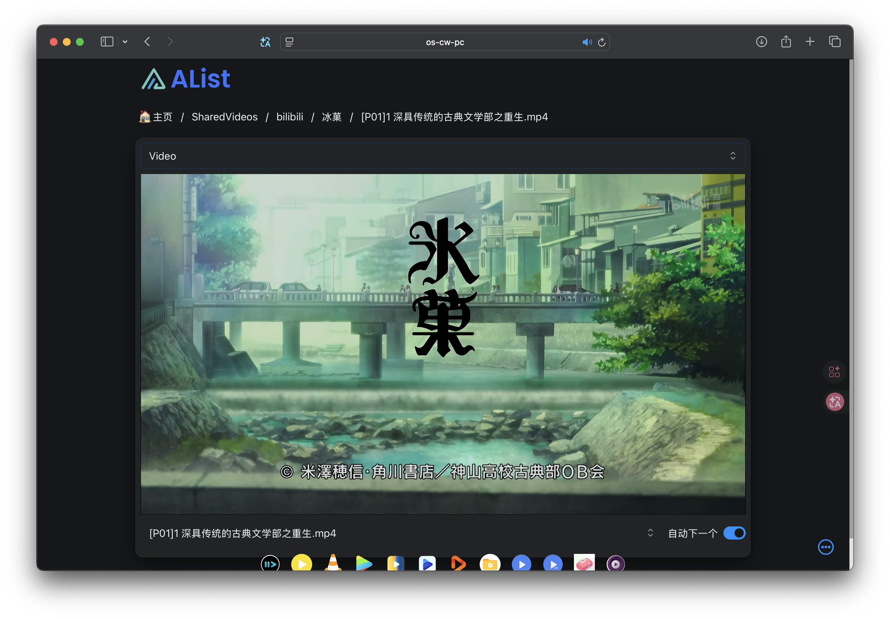

# 节约存储空间

Mac（特别是 256G 存储的）可以说是寸土寸金了，随便下点东西存储就会觉得有点吃紧（<s>也有可能是我有些存储焦虑</s>），但是有一说一，能节约一些可以节约的金子存储去存别的东西还是很有必要的. 本节的内容核心实际上就是：将能存到别的已经有的或便宜的存储上的东西向这些存储上转移，从而将问题转换成如何建立有效的和这些存储之间的文件传输与通信.

可能你没听懂，<s>没事我第一遍写的时候我也没懂.</s> 下面我会结合自己的使用经历用具体的情境解释我刚刚想表达的意思.

## 构建本地“服务器”+“网盘”

::: info 阅前须知

本节内容适用于你有一台存储较大的固定电脑以及一台随手的 Mac 的情形，因为是结合我自己的使用经历. 不过即便不适用也可能会给你一些启发吧，毕竟远程互联还算是比较有用的技巧的.

下面约定“本地”电脑为你的随手 Mac，“远程”电脑为另一台电脑.
:::

加引号的原因是因为实际上并不是构建常规意义上的服务器和网盘，而是让远程的电脑充当能够为本地电脑提供服务并存储大文件的终端. 这样就可以将一些需要很大本地存储的（并且能在终端上进行或者能通过网络协议访问）的服务放到远程电脑上，本地通过通信去调用这些服务就好了.

::: example collapse 举个栗子来说明这样做的便利之处

你是一名折工大学计算机专业的学生，需要上一门名为“计算机系统”的软硬件贯通实验课程，课程要求你在本地 Windows 电脑上安装一个 Ubuntu 子系统，并克隆一个 20G 左右大小的仓库到本地进行开发，通过编写要求的 Verilog 代码来实现一个 CPU 的设计，需要在本地进行仿真测试，且需要安装一个 40G 左右大小的 Vivado 用于将你开发的抽象组件编译成比特流烧蚀在开发板上验证硬件性能的正确性. 课程每周为你准备了一个时间段的实验验收课，你需要携带你的电脑前去进行仿真测试和生成比特流并下板的软硬件实验验收，如果你非常幸运购买了类似于拯救者这样的电脑那么你将携带一块板砖前去验收；而如果你携带的是 Windows 轻薄本，验收课通常不能提供让你的电脑保持充电的环境，这时你的仿真和下板的速度都会受到很大的影响. 而这种时候如果有一种方法能让你携带一台一只手就能托起的 MacBook 就能仿真+下板，方法就是将你的实际运行系统课需要的 Windows 放在寝室里插着电充当服务器，自己只需要远程连接这个满血服务器就可以在 Mac 上看到仿真+下板的结果了，试问你不会爽飞吗（

本事例为个人编造，如有雷同纯属巧合（

:::

上面这个例子有点专业，但想表达的情境很简单：

- 你有一个需要大量存储空间的服务，甚至这项服务可能不支持移植到 Mac 上（或者移植过来效果不如留在本地）.
- 运行该服务的电脑（一般为 Windows）因为各种原因不方便被你随身携带.
- 你有一台 MacBook.

那么只要让不方便携带的电脑固定下来作为服务器，Mac 调用远程服务就能很好的解决这个问题. 

说了这么多，那么问题来了：如何让远程电脑成为服务器，又如何让 Mac 调用这远程服务？下面提供两种方法.

### 远程控制软件

很简单，将远程的桌面投放到 Mac 本地就行了，因为实际上操作的 Windows 在固定之后（一般认为能插电）处于满血状态所以我们认为该服务在 Windows 上运行良好. 由于远程控制软件一般能将远程的桌面投放到本地电脑，在保持网络畅通的情况下，通过图形界面操作本地电脑上的远程桌面和操作远程电脑没什么区别，因此不过多赘述. 

在前一节中推荐了 [UU 远程](../software/index.md#uu-远程)，基本上能保持畅通，所以直接使用该软件通过远程控制就可以.

### SSH

不得不承认，图形界面确实非常方便，但是很多时候（尤其是计算机专业的学生）能通过命令行进行操作还是会更好一些. 这种情况下 SSH 就是一个很不错的选择（甚至可能是熟悉命令行操作的人能想到的第一选择）. 

SSH 是一个非常经典的远程登录协议，能够让用户通过命令行的方式远程连接到另一台电脑上进行操作. 可能你比较熟悉通过 SSH 连接到远程租借的服务器，在提供服务器的控制台处复制 SSH 命令运行即可. 但实际上，SSH 也完全支持你手上的两台电脑互联，只要搭建好 SSH 服务即可.

下面假设你的远程电脑是 Windows 系统，如果是类 Unix 系统的话直接问 AI 吧，基本上不会出问题. 首先需要确定电脑上是否存在 SSH 服务：

```powershell
Get-WindowsCapability -Online | Where-Object Name -like 'OpenSSH.Server*'
```

如果返回 `State : NotPresent`，说明没有安装 SSH 服务，需要安装：

```powershell
Add-WindowsCapability -Online -Name OpenSSH.Server~~~~0.0.1.0
```

在确认存在 SSH 服务之后，启动 SSH 服务（如有必要，设置为开机自启）：

```powershell
# 启动服务
Start-Service sshd
# 设置为开机自启
Set-Service -Name sshd -StartupType 'Automatic'
```

完成上述步骤之后，远程电脑就已经成为了一个 SSH 服务器了，不过默认连接到远程电脑会进入 cmd，如果想要默认进入 PowerShell 的话需要修改注册表：

```powershell
New-ItemProperty -Path "HKLM:\SOFTWARE\OpenSSH" -Name "DefaultShell" -Value "C:\Windows\System32\WindowsPowerShell\v1.0\powershell.exe" -PropertyType String -Force
```

接下来的问题是 Mac 如何通过 ssh 连接到远程电脑. 常规的通过 `ipconfig/ifconfig` 来获取远程电脑的 IP 并访问的方法有很多局限性，比如需要在同一局域网内、不固定 IP 地址等，这里就要介绍一个非常好用的工具 [tailscale](https://tailscale.com)，它能够让你的两台电脑处于同一个虚拟局域网内，并且固定每台设备的 IP 地址，从而实现跨局域网组网，只需要在两台电脑上都安装 tailscale，注册同一个账号并登录即可，在 tailscale 的控制台里可以查看标识本机的 IP（一般为 `100.**.**.**`），在 ssh 时直接 `ssh user@100.**.**.**` 即可.

::: note collapse 进一步的配置
在此基础上，还可以配置免密码登录. 可以使用 sshpass（自行搜索），更推荐的是配置 SSH 密钥登录：

- 首先生成密钥，比如在本地电脑生成密钥，可以命名为 `win_id_xxx`，取决于你采用的算法.
    ```bash
    $ ssh-keygen -t rsa
    # 直接一路回车即可，或者指定生成的密钥名称
    Generating public/private rsa key pair.
    Enter file in which to save the key (/Users/jayi0908/.ssh/id_rsa): /Users/jayi0908/.ssh/win_id_rsa
    # 剩下的一路回车即可
    ```
- 然后将密钥发送给远程电脑：
    ```bash
    # 这里需要输入一次密码，以后就再也不用了
    ssh-copy-id user@host
    # 若采用了自定义的密钥名则需要显式指定上传的密钥
    ssh-copy-id -i ~/.ssh/win_id_rsa.pub user@host
    ```
- 直接免密登录即可：
    ```bash
    ssh user@host
    # 若采用了自定义的密钥名则需要显式指定上传的密钥
    ssh -i ~/.ssh/win_id_rsa user@host
    ```
    当然每次都显式指定很麻烦，由于 SSH 配置同样可用于 VSCode 这样的 IDE Remote 连接中，因此可以配置 `~/.ssh/config` 文件. 这里以我的 `config` 文件为例：
    ```txt
    Host win  # 这里是你自定义的别名，以后可以用 ssh win 登录
        HostName <服务器IP地址>
        User <你的用户名xxx>
        Port 22 # 默认 SSH 开在 22 端口，非 22 端口要显式指定
        IdentityFile ~/.ssh/win_id_rsa  # 指定刚才生成的私钥
    ```
    这样直接 `ssh win` 就能免密登录了，同样在 VSCode Remote 连接时也可以直接选择 `win` 这个配置进行连接了.
:::

当两台设备处于同一个局域网时，直接使用 tailscale 的 IP 进行 SSH 就可以了，因为此时走的是 LAN 直连，延迟很低. 但是如果两台设备位于不同的网络环境中，就需要分情况讨论了：

- 远程电脑处于公网 / 宽松 NAT 环境中，比如远程电脑处于家中，通过宽带路由器接入互联网，这时 tailscale 的 IP 仍然可以直接使用，因为 tailscale 会自动穿透 NAT，建立 P2P 连接，此时连接延迟略高于同局域网连接，影响因素取决于两地物理距离及运营商路由走向.
- 两台电脑都处于严格 NAT 环境中，比如远程电脑处于公司网络或者校园网络中，本地电脑位于该网络之外，这时如果还使用 tailscale 的 IP 进行 SSH 连接，tailscale 会回退至 DERP（中继）模式，将流量转发到它的中继服务器上进行通信，使用 `tailscale netcheck` 命令可以查看本地电脑的网络环境，以及通过 `tailscale ping <远程电脑的 tailscale IP>` 来测试连接的延迟以及网络通路情况，比如下面是我的 Mac 连接到远程电脑的测试结果：

```bash
$ tailscale ping 100.**.**.**
pong from jayi0908-de-win (100.**.**.**) via DERP(hkg) in 3.997s
pong from jayi0908-de-win (100.**.**.**) via DERP(hkg) in 1.216s
pong from jayi0908-de-win (100.**.**.**) via DERP(hkg) in 653ms
pong from jayi0908-de-win (100.**.**.**) via DERP(hkg) in 270ms
pong from jayi0908-de-win (100.**.**.**) via DERP(hkg) in 3.538s
pong from jayi0908-de-win (100.**.**.**) via DERP(hkg) in 3.488s
```

可以看到中继服务器为 `hkg`，延迟是非常高的. 实际上 taiscale 官方 DERP 节点多位于海外，受限于国际链路质量和中继负载，延迟往往达到数百毫秒甚至秒级，最近的香港服务器也有较高的延迟，因此走中继服务器的话 SSH 会有较为严重的指令滞后问题，此时就需要想办法打通其他的信道.

#### 自建 DERP 节点

既然 tailscale 的官方 DERP 节点由于不位于国内导致连接延迟较慢，那么只要能自己搭建一个国内的 DERP 节点就能解决这个问题了. 要做到这一点，首先需要购买一个云服务器，由于实际上只做流量转发，因此服务器的配置基本上没有影响，只要保证通信质量（跨网质量）和价格就可以了（个人体验下来轻量通信的情况下 1 核 1 G 内存的服务器就能满足需求了）. 由于购买的是国内的服务器，所以可能需要配置代理，可以考虑在服务器上下载 [<icon-mdi-github /> MetaCubeX/mihomo](https://github.com/MetaCubeX/mihomo)（套皮 clash），通过 gh-proxy 等镜像站或者先下载到本地然后用 `scp` 上传到服务器上都可以，可以自行搜索相关教程，这里不赘述了. 

更简单的方法是利用 SSH 反向代理将本机的网络代理流量转发到服务器上，这样就不需要在服务器上配置科学上网工具了，方法是在连接到服务器时添加 `-R` 参数：

```bash
ssh -R 7890:localhost:<port> user@host
```

这里 `<port>` 的值为本机混合代理端口的值，一般为 7890 或 7897 之类的，可查看代理软件得到. 然后在服务器端配置 `http_proxy` 和 `https_proxy` 环境变量指向 `http://localhost:7890` 即可，一个可以参考的配置是：

```bash
alias proxyon='export http_proxy=http://127.0.0.1:7890 https_proxy=http://127.0.0.1:7890'
alias proxyoff='unset http_proxy https_proxy'
```

这样在服务器上执行 `proxyon` 就能打开代理，而执行 `proxyoff` 就能关闭代理了. 缺点是需要保持 SSH 连接不断开，如果服务器需要 24h 保持能使用网络代理的情况的话还是需要在服务器上下载科学上网工具.

在配置好代理后就可以进行后续步骤了. 首先需要配置端口映射，如果你没有已备案的域名的话需要避开公网上转发到 `80/443` 端口，可选择一些不太常见的端口进行转发，如果有备案域名的话保持内网与外网端口一致即可：

- 配置一条 TCP 端口转发规则，内网端口选择 `443`，外网端口选择一个不太常见的端口比如 `8443`.
- 配置一条 UDP 端口转发规则，内网端口选择 `3478`，外网端口选择一个不太常见的端口比如 `33478`.

然后需要安装 docker，因为配置过代理所以这里直接拉取官方的源下载即可.

```bash
# 安装 docker
curl -fsSL https://get.docker.com -o get-docker.sh
sudo -E sh get-docker.sh # 添加 -E 参数以保留环境变量，这样能确保代理在安装过程中生效
```

接下来需要配置 DNS 解析与证书并拉取 DERP 的镜像（这里推荐使用 `fredliang/derper`），分两种情况：

- 如果你有自己的域名，可以在域名控制台添加一条 `A` 记录（例如 `derp.domain.com`），指向服务器的公网 IP 地址，并可以凭借该域名使用 `acme.sh` 申请 SSL 证书. 首先需要安装脚本：

    ```bash
    # 安装脚本，将 my@example.com 换成你的真实邮箱
    curl https://get.acme.sh | sh -s email=my@example.com
    # 让别名生效（或者重新登录服务器）
    source ~/.bashrc
    ```

    下面介绍通过 DNS API 模式申请 Let's Encrypt 证书的步骤，也有其他的方法，这里按下不表. 以 Cloudflare 提供云解析服务为例，首先进入 Cloudflare 的控制台，在 Profile -> API Tokens 中创建一个 Token，选择 Edit Zone DNS Template，在 Zone Resources 处选择你的域名，最后创建并复制该 Token 的值，导入到服务器上：

    ```bash
    export CF_Token="你的 Cloudflare API Token"
    export CF_Account_ID="你的 Cloudflare 账号 ID"
    ```

    然后就可以申请并安装证书了：

    ```bash
    # 申请证书
    acme.sh --issue --dns dns_cf -d derp.domain.com
    # 创建存放证书的目录
    mkdir -p /var/lib/derper/certs
    # 安装证书
    acme.sh --install-cert -d derp.domain.com \
        --key-file       /var/lib/derper/certs/derp.domain.com.key \
        --fullchain-file /var/lib/derper/certs/derp.domain.com.crt \
        --reloadcmd      "docker restart derper"
    ```

    这里 `--reloadcmd` 允许证书即将过期时重启 DERP 服务来更新证书，确保证书能够持续生效. 通过如下命令启动 DERP 服务：

    ```bash
    # 启动 DERP 服务，没有拉取过镜像的话会自动拉取
    docker run -d \
      --name derp \
      --restart always \
      -p 443:443 \
      -p 3478:3478/udp \
      -v /var/lib/derper/certs:/app/certs \
      -e DERP_DOMAIN=derp.domain.com \
      -e DERP_ADDR=:443 \
      -e DERP_STUN=true \
      -e DERP_HTTP_PORT=-1 \
      -e DERP_CERT_MODE=manual \
      -e DERP_CERT_DIR=/app/certs \
      -e DERP_VERIFY_CLIENTS=false \
      fredliang/derper
    ```

- 如果没有域名的话就需要使用自签证书了，因为无法申请到受信任的证书：

    ```bash
    # 创建存放证书的目录
    mkdir -p ~/derp_certs
    # 生成自签名证书（有效期100年）
    # 将 **.**.**.** 替换为你的服务器实际公网 IP
    openssl req -x509 -newkey rsa:4096 -sha256 -days 36500 -nodes \
      -keyout ~/derp_certs/derp.key -out ~/derp_certs/derp.crt \
      -subj "/CN=**.**.**.**" -addext "subjectAltName=IP:**.**.**.**"
    ```

    通过如下命令启动 DERP 服务，和上面的命令区别在于使用的证书和域名不同：

    ```bash
    docker run -d \
      --name derp \
      --restart always \
      -p 443:443 \
      -p 3478:3478/udp \
      -v ~/derp_certs:/app/certs \
      -e DERP_DOMAIN=**.**.**.** \
      -e DERP_ADDR=:443 \
      -e DERP_STUN=true \
      -e DERP_HTTP_PORT=-1 \
      -e DERP_CERT_MODE=manual \
      -e DERP_CERT_DIR=/app/certs \
      -e DERP_VERIFY_CLIENTS=false \
      fredliang/derper
    ```

最后需要在 tailscale 的控制台里将 DERP 服务器的地址和配置加入到自己的网络中，访问 [tailscale 控制台](https://login.tailscale.com/admin/acls/file)的 Access Control 部分，在 JSON Editor 界面添加以下 derpMap 配置并保存：

```json
"derpMap": {
    "OmitDefaultRegions": false,
    "Regions": {
        "901": {
            "RegionID": 901,
            "RegionCode": "Your Custom DERP",
            "RegionName": "ha ji mi o nan bei lv dou",
            "Nodes": [
                {
                    "Name": "1",
                    "RegionID": 901,
                    "HostName": "derp.domain.com", // 如果使用域名的话这里填域名，否则填服务器公网 IP 地址
                    "DERPPort": 8443, // 填写端口映射配置的 TCP 转发外网端口
                    "STUNPort": 33478, // 填写端口映射配置的 UDP 转发外网端口
                    "InsecureForTests": false // 如果使用自签证书的话这里需要设置为 true，否则保持 false
                }
            ]
        }
    }
}
```

完成上述步骤之后，可以运行 `tailscale netcheck` 来测试网络环境，不出意外的话就能看到多了一个刚刚配置的 DERP 服务器，并且延迟较低：

```txt
* DERP latency:
	- Your Custom DERP: 28ms    (ha ji mi o nan bei lv dou)
	- nue: 181.8ms (Nuremberg)
	- hkg: 186.4ms (Hong Kong)
	- lax: 191.6ms (Los Angeles)
	- sfo: 191.7ms (San Francisco)
	- den: 206.1ms (Denver)
	- dfw: 206.2ms (Dallas)
	- sea: 219ms   (Seattle)
	- tok: 223ms   (Tokyo)
	- hel: 227.7ms (Helsinki)
	- ord: 230.7ms (Chicago)
	- nyc: 235.3ms (New York City)
	- mia: 238.1ms (Miami)
	- iad: 238.6ms (Ashburn)
	- tor: 241.5ms (Toronto)
	- par: 241.5ms (Paris)
	- hnl: 242.8ms (Honolulu)
	- fra: 247.8ms (Frankfurt)
	- waw: 257.8ms (Warsaw)
	- lhr: 262.3ms (London)
	- mad: 269.9ms (Madrid)
	- ams: 271.1ms (Amsterdam)
	- sin: 287.8ms (Singapore)
	- syd: 324ms   (Sydney)
	- blr: 354.2ms (Bengaluru)
	- dbi: 358ms   (Dubai)
	- sao: 379ms   (São Paulo)
	- jnb: 419.8ms (Johannesburg)
	- nai: 422ms   (Nairobi)
```

通过 `tailscale ping <远程电脑的 tailscale IP>` 测试连接的延迟以及网络通路情况，应该能看到通过自建 DERP 服务器连接的延迟已经大幅降低了：

```bash
$ tailscale ping 100.**.**.**
pong from jayi0908-de-win (100.**.**.**) via DERP(Your Custom DERP) in 53ms
pong from jayi0908-de-win (100.**.**.**) via DERP(Your Custom DERP) in 53ms
pong from jayi0908-de-win (100.**.**.**) via DERP(Your Custom DERP) in 52ms
pong from jayi0908-de-win (100.**.**.**) via DERP(Your Custom DERP) in 55ms
pong from jayi0908-de-win (100.**.**.**) via DERP(Your Custom DERP) in 53ms
pong from jayi0908-de-win (100.**.**.**) via DERP(Your Custom DERP) in 53ms
```

#### 其他方法

由于双方处于对称 NAT 环境中，实际上可以通过将远程电脑的 SSH 端口映射到某个公网端口，这可以通过内网穿透来实现. 不过我没有使用过这类工具，这里就不写了，可以自行搜索相关教程.

总而言之，通过上述方法就能让远程电脑成为一个能够被 Mac 访问的服务器了，只不过远程桌面操作更加自由（可以通过远程控制软件基本上还原在远程电脑上操作的体验），并且服务器的承载能力更大（可以存储更多的文件，运行更吃资源的服务）. 以我本人为例，我就将硬件课要用的 Ubuntu 和 装有 texlive 的 Deepin 系统放在远程电脑上，通过 SSH 连接到远程电脑上进行仿真和编译，将这部分空间占用从本地电脑上转移到了远程电脑上.

### AList

> AList 是一个支持多种存储，支持网页浏览和 WebDAV 的文件列表程序，由 gin 和 Solidjs 驱动. —— AList 官方文档

AList 可以将本地或者远程的存储的文件结构以非常美观的方式展示出来，并且支持通过 WebDAV 协议访问这些文件. 借助上一节提到的 tailscale，我们可以将本机的文件系统通过 AList 加载本机存储文件的方式让远程电脑访问到本地的文件系统. 具体配置可参照[官方文档](https://alistgo.com/zh/guide/)进行. 默认服务会开放在 `5244` 端口，在浏览器访问 `http://<本机的 tailscale IP>:5244` 就能看到 AList 的界面了.

AList 不错的一点是它支持云端音视频的在线播放功能，通过网页端可以直接访问存储在本地或者远程的音视频文件进行在线播放了，因为 AList 的界面设计的还算不错，所以在网页端的播放体验还是很好的.

<figure style="text-align: center;">

<!-- <figcaption> -->
<small>AList 界面截图</small>
<!-- </figcaption> -->
</figure>

并且 AList 还支持将视频转移到本地的 IINA、VLC、PotPlayer 等 AList 推荐的播放器（即网页端视频播放下方的那些播放器）以及其他如 VidHub 等支持 WebDAV 协议的播放器上进行播放，使用过 Mac 播放器的话应该知道 Mac 的播放器视觉效果还是非常不错的，沉浸感很足.

<figure style="text-align: center;">

<!-- <figcaption> -->
<small>AList 转本地播放器效果</small>
<!-- </figcaption> -->
</figure>

至于播放什么音视频就取决于各位了，<s>我也不懂哦.</s> 不过至少通过 AList，你能在 Mac 上也方便的访问到远程电脑上的存储了（以一种更美观的方式），某种程度上来讲这就是将远程电脑当做一块网盘来使用，只不过这块网盘的功能要更强大，上下行速度也比一般的网盘快得多.

## 购买外接硬盘

再怎么说，将资源全部转移到远程电脑上也不是一个合适的办法，因为这样网络通信的开销会非常大，如果使用自建服务器的话会产生不少的额外费用，并且为了性价比配置的上行速度一般也不会很高，不管怎么说有一块能本地读写的、并且读写速率较快的存储设备还是很有必要的，这时购买一块外接硬盘就是一个不错的选择了. 但我不是数码测评区的，所以不推荐具体的型号了，不过根据我的购买经历，（可能是）由于近几年存储涨价，中低档价位购买成品的外接硬盘和购买硬盘盒+内存条的价格大差不差，如果参考前几年的测评视频的话可能会发现推荐的外接硬盘方案现在并不是最划算的，所以推荐查看最近两年的测评视频作为参考.