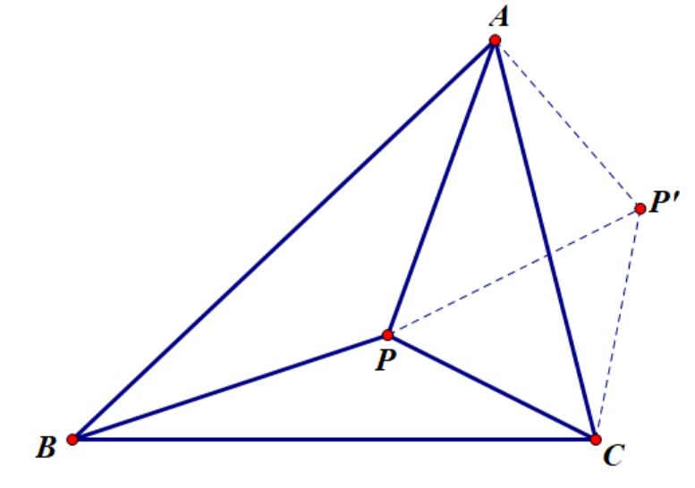
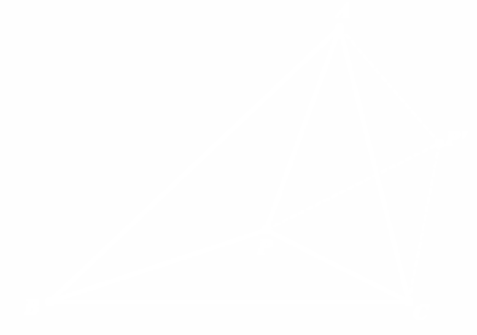

在解决几何问题的过程中，有一个较为常见的构型：
<figure>

<!-- <figcaption> -->
<small>塞瓦型</small>
<!-- </figcaption> -->
</figure>
$P$ 为 $\triangle A B C$ 内一点，考察 $P A \cdot B C$的性质。

由于这是一个二次式，而正弦定理是一次式，塞瓦定理、梅涅劳斯定理是齐次式，而与二次相关的直接结论便是余弦定理，但余弦定理的交叉项需要两条边共顶点，图中的这两条边$P A$与$B C$显然不满足这一点，所以已有的定理无法直接处理这个问题。

这时就需要如下引理：

---

!!! thm "Ceva型引理"
    

    图如上，则有：
    

    $$ \dfrac{P A \cdot B C}{\sin(\angle B P C-\angle B A C)}=\dfrac{P B \cdot A C}{\sin(\angle A P C-\angle A B C)}=\dfrac{P C \cdot A B}{\sin(\angle A P B-\angle A C B)}. $$

---

??? proof "引理之证明"
    构造相似形如下：
    {: class="only-light", style="height: 160px; float: right"}
    {: class="only-dark", style="height: 160px; float: right"}
    其中 $\triangle A B P \sim \triangle A C P'$，故又有 $\triangle A B C \sim \triangle A P P'$，从而：
    $$ \dfrac{B C}{P P'}=\dfrac{A B}{A P}. $$
    而
    $$ \dfrac{P P'}{\sin \angle P C P'}=\dfrac{P C}{\sin \angle C P P'}, $$
    且 $\angle P C P'=\angle A B P+\angle A C P=\angle B P C-\angle B A C$, $\angle C P P'=\angle A P C-\angle A B C$, 故有：
    $$ P A \cdot B C=A B \cdot \dfrac{P C \sin(\angle B P C-\angle B A C)}{\sin(\angle A P C-\angle A B C)} $$
    即
    $$ \dfrac{P A \cdot B C}{\sin(\angle B P C-\angle B A C)}=\dfrac{P C \cdot A B}{\sin(\angle A P B-\angle A C B)} $$
    同理有其他两式。结论得证。

---

!!! Note "值得一提的是"
    此引理是笔者遇到的印象十分深刻的引理，在某些情况下有化腐朽为神奇之用

下面用一个例子展示一下这个引理的强大之处：

{: class="only-light", style="height: 180px; float: left"}
{: class="only-dark", style="height: 180px; float: left"}

$\space$

P为 $\triangle A B C$ 外接圆上一动点，$I_1$ 和 $I_2$ 为 $\triangle A B P$ 和 $\triangle B C P$ 的旁心，证明：$\triangle I_1 I_2 P$ 的外接圆过不依赖于 $P$ 的定点。

 

---

??? proof "问题之证明"
    证明：设 $\triangle A B C$ 的外接圆为 $\omega$，令 $\odot I_1 P I_2 \cap \omega$ 于 $F$，我们证明 $F$ 即为所求.
    设 $B I_1$ 交 $\omega$ 于 $D$，$C I_2$ 交 $\omega$ 于 $E$，记 $\angle B A D=\alpha$，$\angle F A D=\beta$，利用旁心导角有：
    $$ \angle A I_1 P=\dfrac{\angle A X P}{2}=\dfrac{B+\angle C A P}{2}=\dfrac{A+B-2 \alpha}{2}=\dfrac{\pi-C}{2}-\alpha, $$
    $$ \angle I_1 A P=\alpha \Rightarrow\angle A P I_1=\dfrac{\pi+C}{2} $$
    同理：$$ \angle A P I_2=\dfrac{\pi+B}{2} , \angle I_1 P I_2=\dfrac{\pi+A}{2} $$
    $$ \angle I_1 I_2 F=\angle I_1 P F=\angle A F P-\angle I_1 A F-\angle A I_1 P=\angle A I_1 P-\angle I_1 A F=\dfrac{\pi-C}{2}-\alpha-\beta $$
    $$ \angle I_2 I_1 F=\pi-\angle I_1 I_2 F-\angle I_1 P I_2=\dfrac{C-A}{2}+\alpha +\beta, \angle I_2 A F=\dfrac{A}{2}-\beta. $$
    从而
    $$ \angle I_1 I_2 F+\angle I_1 A F=\dfrac{\pi-C}{2}-\alpha, \angle I_2 I_1 F+\angle I_2 A F=\dfrac{C}{2}+\alpha. $$
    由引理：
    $$ \dfrac{I_1 F \cdot A I_2}{\sin(\dfrac{\pi-C}{2}-\alpha)}=\dfrac{I_2 F \cdot A I_1}{\sin(\dfrac{C}{2}+\alpha)} $$
    $$ \Rightarrow \dfrac{I_1 F}{I_2 F}=\dfrac{A I_1}{A I_2} \cdot \dfrac{\cos(\dfrac{C}{2}+\alpha)}{\sin(\dfrac{C}{2}+\alpha)}. $$
    而由内心性质
    $$ A I_1=4R \cos \dfrac{\angle A B P}{2} \cos \dfrac{\angle A P B}{2}=4R \cos \frac{\pi-C-2\alpha}{2} \cos \dfrac{C}{2}=4R \sin (\dfrac{C}{2}+\alpha) \cos \dfrac{C}{2}, $$
    $$ A I_2=4R \cos \dfrac{\angle A C P}{2} \cos \dfrac{\angle A P C}{2}=4R \cos (\dfrac{C}{2}+\alpha) \cos \dfrac{B}{2}, $$
    $$ \Rightarrow \dfrac{I_1 F}{I_2 F}=\dfrac{\sin \angle I_1 I_2 F}{\sin \angle I_2 I_1 F}=\dfrac{\cos(\dfrac{C}{2}+\alpha+\beta)}{\sin(\dfrac{C-A}{2}+\alpha+\beta)}=\dfrac{\cos(\dfrac{C}{2}+\angle B A F)}{\sin(\dfrac{C-A}{2}+\angle B A F)}=\dfrac{\cos \dfrac{C}{2}}{\cos \dfrac{B}{2}} $$
    由余切联合定理知 $\tan \angle B A F$ 为只依赖于 $A,B,C$ 的值，所以 $F$ 为定点，得证.
