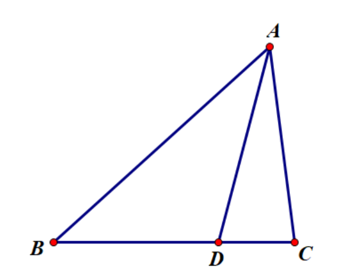

# 余弦定理系

和正弦定理系一样，我们可以借助余弦定理得到一些有用的推论，并将其统称为余弦定理系.

## 等差幂线定理

::: thm 等差幂线定理
{class="only-light" style="height: 150px; float: left"}
{class="only-dark" style="height: 150px; float: left"}

如图，则有：

$$ AB\perp CD\iff AC^2-BC^2=AD^2-CD^2. $$

:::

::: proof collapse 定理之证明
证明是简单的，取出垂足利用勾股定理即可（必要性直接取，充分性对垂足用同一法即可）.
:::

除了一般的几何刻画，等差幂线定理在三角证明中也是常有一席之地，特别是在边的平方能被妥善处理时，等差幂线定理会是不错的选择.

## 斯特瓦尔特定理

::: thm 斯特瓦尔特定理
{class="only-light" style="height: 150px; float: left"}
{class="only-dark" style="height: 150px; float: left"}

如图，则有：

$$ AD^2=AB^2\cdot\dfrac{DC}{BC}+AC^2\cdot\dfrac{BD}{BC}-\overrightarrow{BD}\cdot\overrightarrow{DC}. $$

:::

::: proof collapse 定理之证明
利用向量运算和余弦定理：

$$\begin{aligned} AD^2 &=(\overrightarrow{AB}+\overrightarrow{BD})(\overrightarrow{AC}-\overrightarrow{DC})\\
&=\overrightarrow{AB}\cdot\overrightarrow{AC}-\overrightarrow{AB}\cdot\overrightarrow{DC}+\overrightarrow{BD}\cdot\overrightarrow{AC}-\overrightarrow{BD}\cdot\overrightarrow{DC}\\
&=\dfrac{1}{2}(b^2+c^2-a^2+\dfrac{DC}{BC}(c^2+a^2-b^2)+\dfrac{BD}{BC}(b^2+a^2-c^2))-\overrightarrow{BD}\cdot\overrightarrow{DC}\\
&=c^2\cdot\dfrac{DC}{BC}+b^2\cdot\dfrac{BD}{BC}-\overrightarrow{BD}\cdot\overrightarrow{DC}. \end{aligned}$$
:::

与张角定理相似，斯特瓦尔特定理也可以（甚至是只能）用来计算分角线长度，但是很明显，二者应用的情形不同：

- 在对边比例已知而分角未知时，斯特瓦尔特定理是更优解;
- 而在对边未知而分角已知时，张角定理更合适.

## 托勒密定理

::: thm 托勒密定理
{class="only-light" style="height: 150px; float: left"}
{class="only-dark" style="height: 150px; float: left"}

如图，则有：

$ABCD$ 为圆内接四边形 $\iff AB\cdot CD+AD\cdot BC=AC\cdot BD$.

:::

::: proof collapse 定理之证明

为了化简方便，我们令 $AB=a,BC=b,CD=c,AD=d,AC=e,BD=f$.

则由余弦定理：$\cos\angle BAD=\dfrac{a^2+d^2-f^2}{2ad}$，$\cos\angle BCD=\dfrac{b^2+c^2-f^2}{2bc}$，

且由圆内接 $\cos\angle BAD+\cos\angle BCD=0$，整理得：

$$\begin{aligned} f^2(ad+bc)&=(a^2+d^2)bc+(b^2+c^2)ad\\
&=(a^2bc+b^2ad)+(d^2bc+c^2ad)\\
&=ab(ac+bd)+cd(ac+bd)=(ab+cd)(ac+bd). \end{aligned}$$

同理对 $\angle ABC$ 与 $\angle ADC$ 可得 $e^2(ab+cd)=(ad+bc)(ac+bd)$.

两式相乘得 $(ef)^2=(ac+bd)^2$，此即为所证.

:::

---

托勒密定理使用正弦定理将三条边转为正弦之后即可得到“著名”的**三弦定理**：

::: thm 三弦定理

$A,B,C,D$ 四点共圆 $\iff AB\sin\angle CAD+AD\sin\angle BAC=AC\sin\angle BAD.$  

:::

::: note 补充
    
虽然是由余弦定理推出的托勒密定理的直接推论，但是我认为三弦定理更应该属于“正弦定理系” ——因为余弦定理系全为二次式，而正弦定理系则多为一次式或其次比例式.

:::

与张角定理相似，三弦定理的优越性在于它只要有一个点 $A$ 处的三条线组成的分角和三条线的长度就可以确定共圆关系，而不关心 $B,C,D$ 这样的点在哪里，以及它们之间的关系.

更重要的是，它给出了四点共圆的一个简洁且可操作的解析刻画，相较于坐标、向量与复数，三弦定理让三角法解四点共圆问题变得非常有优势，也比纯几何方法更加“不动脑子”——只需要分别审视一下四个点，哪个点适合当作引出三条线的顶点（取决于这个点处的分角与长度是否更好），剩下的交给三角化简即可.
