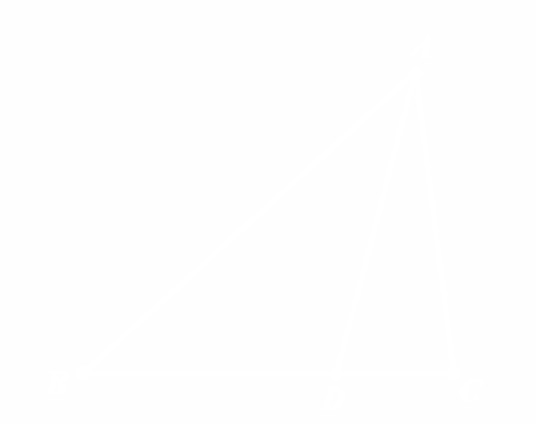
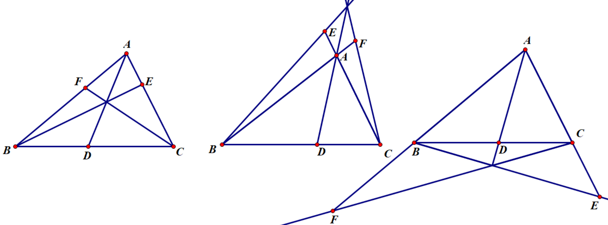
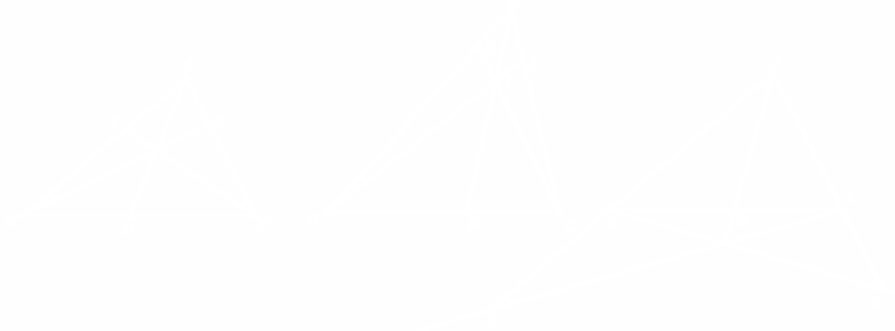

# 正弦定理系

基于正弦定理，我们可以得到一些有用的推论，这些推论在解题中也有广泛的应用，我们将其统称为正弦定理系.

## 共边比例定理

::: thm 共边比例定理
{class="only-light" style="height: 150px; float: left"}
{class="only-dark" style="height: 150px; float: left"}
如图，$\triangle ABC$ 及 $BC$ 边上一点 $D$，有：
$$ \dfrac{BD}{DC}=\dfrac{S_{\triangle ABD}}{S_{\triangle ADC}}. $$

:::

证明见[奠基性的正弦定理](sine.html#共边比例定理)部分.

## 分角定理

::: thm 分角定理

{class="only-light" style="height: 150px; float: left"}
{class="only-dark" style="height: 150px; float: left"}
(<s>对还是这张图</s>)

如图，$\triangle ABC$ 及 $BC$ 边上一点 $D$，有：
$$ \dfrac{BD}{DC}=\dfrac{AB\sin\angle BAD}{AC\sin\angle DAC}. $$

:::

证明见[奠基性的正弦定理](sine.html#分角定理)部分.

分角定理给出了共线线段比例的一般处理方法，以及"分角"（$\angle BAC$ 及其一条分角线 $AD$ 组成的图形）的一种处理方法. 由于构型简单，可被广泛使用.

## 塞瓦定理及其角元形式

::: thm 塞瓦定理
$D,E,F$ 分别在直线 $AB,BC,CA$ 上，则：

$AD,BE,CF$ 三线共点或两两平行 $\iff$ $\dfrac{A D}{D B} \cdot \dfrac{B E}{E C} \cdot \dfrac{C F}{F A}=1.$
:::

::: proof collapse 定理之证明
必要性：

若三线共点，令共点为 $P$，则 
$$\dfrac{B D}{D C} \cdot \dfrac{C E}{E A} \cdot \dfrac{A F}{F B}=\dfrac{[ABP]}{[APC]}\cdot\dfrac{[BCP]}{[BPA]}\cdot\dfrac{[CAP]}{[CPB]}=1.$$

若两两平行，用平行线分线段成比例易得.

充分性：用同一法+必要性的证明即可.
:::

<figure style="text-align: center;">

<!-- <figcaption> -->
<small>多种形式的Ceva定理</small>
<!-- </figcaption> -->
</figure>

将边的分比用分角定理改为分角，则可得到角元塞瓦定理：

::: thm 角元塞瓦定理
$D,E,F$ 分别在直线 $AB,BC,CA$ 上，则

$A D,B E,C F$ 三线共点或两两平行 $\iff$ $\dfrac{\sin \angle B A D}{\sin \angle D A C} \cdot \dfrac{\sin \angle C B E}{\sin \angle E B A} \cdot \dfrac{\sin \angle A C F}{\sin \angle F C B}=1$.
:::

::: proof collapse 定理之证明
定理的证明也很简单，应用塞瓦定理+分角定理，将边的分比转换为角的分比+$\triangle ABC$三条边的轮换对称比例得证.
:::

---

角元塞瓦定理的优越性在于，它不关心 $D,E,F$ 的位置，以及三条线的共点有什么性质，只关心三个分角的比例。在处理“三线共点或两两平行”这件事上有蒙日定理和角元塞瓦定理两大定理抓手，各司其职：

- 蒙日定理关键在于使共点的直线成为根轴，所以在多圆的情况下会成为首选，但是根轴往往不易被发现，需要发掘甚至构造圆与根轴.
- 角元塞瓦定理则限制更少，只要图中的线性条件更多，角元塞瓦定理会成为一个很不错的抓手点.

下面是一个例子：

<Admonition type="example" title="角元塞瓦定理的抛瓦" :collapsible="true">

{class="only-light" style="max-width: 100%; height: auto; float: left; flex: 1; max-width: 40%;"}
{class="only-dark" style="max-width: 100%; height: auto; float: left; flex: 1; max-width: 40%;"}

如图，两圆 $\Gamma_1,\Gamma_2$ 交于 $A,B$ 两点，点 $C,D$ 分别在 $\Gamma_1,\Gamma_2$ 上且线段 $CD$ 与 $\Gamma_1$ 的第二个交点为 $E$，直线 $BC$ 与 $\Gamma_2$ 的第二个交点为 $F$，直线 $DF$ 与 $EB$ 交于点 $G$，直线 $CG$ 与 $AB$ 交于点 $P$，求证：若 $E$ 为 $CD$ 的中点，则直线 $PF$ 与 $CA$ 的交点 $Q$ 在圆 $\Gamma_2$ 上.

(2019-3-希望联盟夏令营-P14)

<Admonition type="proof" title="问题之证明" :collapsible="true">

我们设点 $Q$ 在圆 $\Gamma_2$ 上，反过来证明：$CG,AB,FQ$ 三线共点.

对 $\triangle BFG$ 与三条线使用角元塞瓦定理，即
$$ \iff\dfrac{\sin\angle DFQ}{\sin\angle QFB}\cdot\dfrac{\sin\angle ABC}{\sin\angle EBA}\cdot\dfrac{\sin\angle BGC}{\sin\angle CGF}=1. $$
由于 $G$ 为 $BE$ 和 $DF$ 的交点，故处理 $\dfrac{\sin\angle BGC}{\sin\angle CGF}$ 时需将点 $G$ 消掉.

使用分角定理与梅涅劳斯：
$$ \dfrac{\sin\angle BGC}{\sin\angle CGF}=\dfrac{BC}{CF}\cdot\dfrac{FG}{BG}=\dfrac{BC}{CF}\cdot\dfrac{DF}{BE}\cdot\dfrac{CE}{DC}. $$
由正弦定理 
$$ \dfrac{CE}{BE}=\dfrac{\sin\angle EBC}{\sin\angle BCE}, \dfrac{DF}{DC}=\dfrac{\sin\angle FCD}{\sin\angle DFC}, \dfrac{BC}{CF}=\dfrac{CE}{CD}\cdot\dfrac{\sin\angle CAB\cdot\sin\angle DFC}{\sin\angle EBC\cdot\sin\angle CDF} $$
故 $\dfrac{\sin\angle BGC}{\sin\angle CGF}=\dfrac{CE}{CD}\cdot\dfrac{\sin\angle CAB}{\sin\angle CDF}$，即证：
$$ \dfrac{\sin\angle DFQ}{\sin\angle QFB}\cdot\dfrac{\sin\angle ABC}{\sin\angle EBA}\cdot\dfrac{\sin\angle CAB}{\sin\angle CDF}\cdot\dfrac{CE}{CD}=1. $$
经过探索，我们采用基本量表示的方法：  
设$\angle BCD=\alpha$，$\angle DFQ=\beta$，则导角后即证：  
$$ \dfrac{\sin\beta}{\sin A}\cdot\dfrac{\sin B}{\sin(C-\alpha)}\cdot\dfrac{\sin A}{\sin(A+\alpha+\beta)}\cdot\dfrac{CE}{CD}=1. $$
$$\begin{aligned}\iff \dfrac{2CE}{CD}\sin B\sin\beta&=2\sin(A+\alpha+\beta)\sin(C-\alpha)\\
&=\cos(A-C+2\alpha+\beta)-\cos(A+C+\beta)\\
&=\cos(A-C+2\alpha+\beta)+\cos B\cos\beta+\sin B \sin\beta\end{aligned}$$  
由条件，对 $\triangle ADC$ 用正弦定理：
$$ \dfrac{CD}{\sin\beta}=\dfrac{AC}{\sin(\beta+\alpha-C)}=\dfrac{CE\sin B}{\sin(A+\alpha)\sin(\beta+\alpha-C)}. $$
即
$$\begin{aligned}-\dfrac{2CE}{CD}\sin B\sin\beta&=2\sin(A+\alpha)\sin(C-\beta-\alpha)\\
&=\cos(A-C+2\alpha+\beta)-\cos(A+C-\beta)\\
&=\cos(A-C+2\alpha+\beta)+\cos B\cos\beta-\sin B \sin\beta\end{aligned}$$  
故结论成立 $\iff 2CE=CD$. 得证.

</Admonition>

当然本题不止这一种同一法的思路，但是基本上都是选择让线共点或点共线，而不是线的交点在圆上，因为前者可以利用的性质更多，并且有现成的梅塞定理可以使用.

</Admonition>

## 张角定理

::: thm 张角定理
{class="only-light" style="height: 150px; float: left"}
{class="only-dark" style="height: 150px; float: left"}

如图，$\triangle ABC$ 及一点 $D$，有：

$B,C,D$ 共线 $\iff \dfrac{\sin\angle BAD}{AC}+\dfrac{\sin\angle DAC}{AB}=\dfrac{\sin\angle BAC}{AD}.$

:::
    

>考虑有向角，那么这个式子已经蕴含 $D$ 不在线段 $BC$ 上的情形.

::: proof collapse 定理之证明
用有向面积：

$B,C,D$ 共线 

$$\begin{aligned} &\iff [ABD]+[ADC]=[ABC] \\
&\iff AB\cdot AD\sin\angle BAD+AD\cdot AC\sin\angle DAC=AB\cdot AC\sin\angle BAC\\
&\iff \dfrac{\sin\angle BAD}{AC}+\dfrac{\sin\angle DAC}{AB}=\dfrac{\sin\angle BAC}{AD}.\end{aligned}$$
:::

张角定理的强大之处在于它只要有一个点 $A$ 处的三条线组成的分角和三条线的长度就可以确定共线关系，而不关心 $B,C,D$ 这样的点在哪里，以及它们之间的关系.

相较于坐标、复数等解共线的方程，三角法解共线会更简单一点，特别是作为分母的三条边长度表达式有较多公因式时，通分会简单很多.

除了共线问题的证明，张角定理也常用来进行分角线长度的计算.
