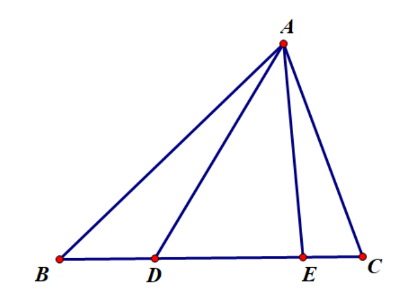
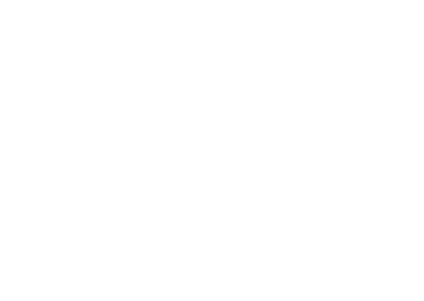

# 变相同一法

变相同一法指的是：

::: thm 变相同一法
{class="only-light" style="height: 150px; float: left"}
{class="only-dark" style="height: 150px; float: left"}

如图，则有

$$ \angle BAD =\angle CAE \iff \dfrac{\sin \angle B A D}{\sin \angle D A C}=\dfrac{\sin \angle C A E}{\sin \angle E A B}. $$

:::
---

::: proof collapse 定理之证明
证明：只需证明充分性即可.  

化为三角形式即：
$$ 0<\alpha,\beta<\theta<\pi,\dfrac{\sin(\theta-\alpha)}{\sin \alpha}=\dfrac{\sin(\theta-\beta)}{\sin \beta} \Rightarrow \alpha=\beta. $$

利用积化和差有：
$$ \iff\cos(\theta-\alpha-\beta)-\cos(\theta-\alpha+\beta)=\cos(\theta-\alpha-\beta)-\cos(\theta-\beta+\alpha) $$
$$ \iff\sin \theta \sin(\beta-\alpha)=0 $$

由 $\theta$ 范围知 $\sin \theta \neq 0$，故 $\beta=\alpha$，得证.
:::

---

利用变相同一法即可将角相等的证明转化为三角式的比例关系，从而可以利用分角定理等进行进一步处理. 
